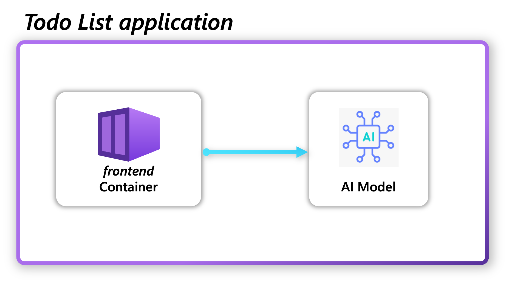

# Todo Application with AI integration
This sample demonstrates a Todo application that uses AI capabilities to provide feedback on tasks, leveraging Radius for deployment across different cloud providers.

## Sample Overview



This sample showcases how to deploy a containerized application that connects to different AI services using Radius. The sample includes:

- A Resource type definition for AI models in types.yaml
- Terraform recipes for deploying the AI model to Kubernetes, Azure and AWS
- TodoList application defined in Bicep

## How to deploy the sample?

### Pre-requisites

- A Kubernetes cluster to host Radius control plane and the Todo List application
- [Edge version of Radius CLI](https://edge.docs.radapp.io/getting-started/install/)
- [Radius installed on your Kubernetes cluster](https://docs.radapp.io/guides/operations/kubernetes/install/)
- [Azure and AWS cloud providers configured in Radius](https://docs.radapp.io/guides/operations/providers/overview/)

### 1. Create AI resource-type 

```bash
rad resource-type create aiModels -f types.yaml
```
### 2. Create Bicep extension

```bash
rad bicep publish-extension -f types.yaml --target radiusResources.tgz
```

### 3. Verify the extension in `bicepconfig.json`
Open bicepconfig.json and verify the `radiusResources` extension is referencing the correct archive file. Bicep extensions in the same working directory can be the filename only. If you move the bicepconfig.json file or the extension archive, you must specify the full file path (not a relative path).

### 4. Publish Recipes

In this sample, we use Terraform configuration as Recipes to deploy Azure Open AI and AWS bedrock services. When you register a recipe with Radius, you are only creating a pointer to a Terraform configurations. Terraform configurations are stored in a git repository. In this sample we are ignoring authentication to the Git repository and container registry. If you need to set up authentication see [this for Terraform](https://docs.radapp.io/guides/recipes/terraform/howto-private-registry/).

**AWS Bedrock**
Push the Terraform configuration to a Git repository. You must use the standard Terraform naming scheme. The `main.tf` file is in the `aws-bedrock` directory

**Azure OpenAI**
Push the Terraform configuration to a Git repository. In this case, the `main.tf` file is in the `azure-openai` directory and requires parameters resource group and location to be passed to the recipe while registering.

**Kubernetes Llama**
Push the Terraform configuration to a Git repository. The `main.tf` file is in the `kubernetes-llama` directory.


### 5a. Setup a Local Environment and register a Llama Recipe

1. Create a resource group for the environment

```
rad group create local
```

Create the `local` environment.

```
rad deploy environments/env-kubernetes.bicep --group local
```

This will create a `local` environment and register the Kubernetes Llama recipe.

Note: If you get a `Error: no environment name or ID provided, pass in an environment name or ID`, you may need to create a dummy environment as a workaround for [this bug](https://github.com/radius-project/radius/issues/9453).

Create a workspace.
```
rad workspace create kubernetes local \
  --context `kubectl config current-context` \
  --environment local \
  --group local
```

Confirm the environment was created. You should see this output.
```
$ rad environment list
RESOURCE   TYPE                            GROUP    STATE
local      Applications.Core/environments  local    Succeeded
```

Confirm the Recipe was registered.
```
$ rad recipe list
RECIPE    TYPE                       TEMPLATE KIND  TEMPLATE VERSION  TEMPLATE
default   Radius.Resources/AIModels  terraform                        git::https://github.com/reshrahim/todoapp-ai.git//recipes/kubernetes-llama
```

### 5b. Set up an AWS Environment and register a Bedrock Recipe

1. Create a resource group for the environment 

```
rad group create aws
```

Update the `env.bicep` file with your AWS Account and region. You will need to update this block:
```
providers: {
  aws: {
    // Update account and region
    scope: '/account/<account-id>/regions/<region-name>'
  }
}
```

Create the `aws` environment.
```
rad deploy environments/env-aws.bicep --group aws
```

This will create a `aws` environment and register the AWS Bedrock recipe.

Note: If you get a `Error: no environment name or ID provided, pass in an environment name or ID`, you may need to create a dummy environment as a workaround for [this bug](https://github.com/radius-project/radius/issues/9453).

Create a workspace.
```
rad workspace create kubernetes aws \
  --context `kubectl config current-context` \
  --environment aws \
  --group aws
```

Confirm the environment was created. You should see this output.
```
$ rad environment list
RESOURCE   TYPE                            GROUP    STATE
aws        Applications.Core/environments  aws    Succeeded
```

Confirm the Recipe was registered.
```
$ rad recipe list
RECIPE    TYPE                       TEMPLATE KIND  TEMPLATE VERSION  TEMPLATE
default   Radius.Resources/aiModels  terraform                        git::https://github.com/reshrahim/todoapp-ai.git//recipes/aws-bedrock
```

### 5c. Set up an Azure Environment and register a OpenAI Recipe

1. Create a resource group for the environment

```
rad group create azure
```

Update the `env.bicep` file with your Azure subscription and resource group. You will need to update this block:
```
providers: {
  azure: {
    // Update subscription and resource group
    scope: '/subscriptions/<subscription-id>/resourceGroups/<resource-group-name>'
  }
}
```
And this block in the OpenAI recipe:
```
parameters: {
  // Update resource group name
  resource_group_name: 'your-resource-group-name',
  location: 'eastus'
}
```
Create the `azure` environment.
```
rad deploy environments/env-azure.bicep --group azure
```
This will create a `azure` environment and register the Azure OpenAI recipe.

Note: If you get a `Error: no environment name or ID provided, pass in an environment name or ID`, you may need to create a dummy environment as a workaround for [this bug](https://github.com/radius-project/radius/issues/9453).

Create a workspace.
```
rad workspace create kubernetes azure \
  --context `kubectl config current-context` \
  --environment azure \
  --group azure
```

Confirm the environment was created. You should see this output.
```
$ rad environment list
RESOURCE   TYPE                            GROUP    STATE
azure      Applications.Core/environments  azure    Succeeded
```

Confirm the Recipe was registered.
```
$ rad recipe list
RECIPE    TYPE                       TEMPLATE KIND  TEMPLATE VERSION  TEMPLATE
default   Radius.Resources/aiModels  terraform                        git::https://github.com/reshrahim/todoapp-ai.git//recipes/azure-openai
```

### 6. Deploy the Todo List Application

Now that you have the environments set up, you can deploy the Todo List application to your local or AWS or Azure environment.

Update the `model` property in the `todolist.bicep` file to specify the AI model you want to use. For example, to use the Llama model, set it to `tinyllama` or for Azure OpenAI, set it to `gpt-35-turbo` or for AWS Bedrock, set it to `claude-3-sonnet-`.

```bicep
resource ai 'Radius.Resources/aiModels@2025-07-14-preview' = {
  name: 'ai'
  properties: {
    application: todolist.id
    environment: environment
    model:'tinyllama'
  }
}
```

Then deploy the Todo List application:

```
rad deploy todolist.bicep -a todolist 
```

Access the Todo List by port forwarding the frontend service:

```bash
rad resource expose Applications.Core/containers frontend -a todolist --port 3000
```

### 7. Clean up

To clean up the resources created by this sample, you can delete the application:

```bash
rad app delete -a todolist 
```

## Cloud Providers & AI Services

### Kubernetes Llama

The application can connect to a Llama model running on Kubernetes. The Terraform recipe configures:

- A Kubernetes deployment for the Llama model
- A service to expose the model for API access

### Azure OpenAI

The application can connect to Azure OpenAI's model for natural language processing. The Terraform recipe configures:

- An Azure Cognitive Services account with OpenAI capabilities
- LLM model deployment for task feedback

### AWS Bedrock

Alternatively, the application can use AWS Bedrock with Anthropic's Claude 3 Sonnet model. The Terraform recipe sets up:

- IAM user with appropriate permissions to invoke Bedrock models
- Access key management for secure API access
- Policy configuration for model invocation

Note that you need to ensure that the AWS Bedrock model is available for your account and region.
